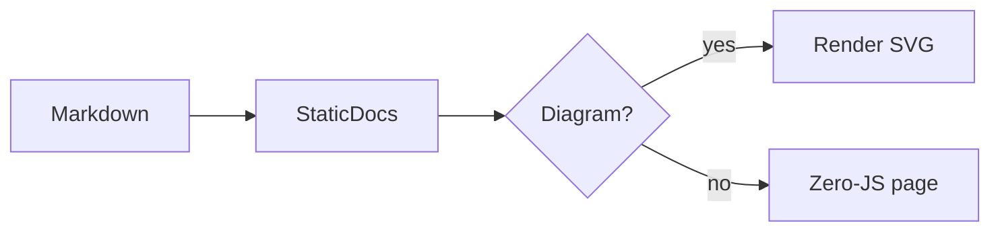
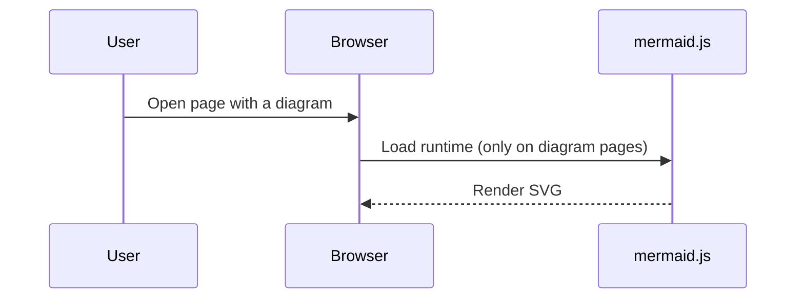

# Repository Context: @krizic/static-docs

_Generated: 2026-07-30T11:32:54.031Z_

## Overview

- **@krizic/static-docs** (package.json) — v0.1.2
  - Turn Markdown into a static documentation site.
  - scripts: build, dev, typecheck, schema, docs, llm, prepublishOnly

## Directory Structure

```
├── .github/
│   └── workflows/
│       ├── ci.yml
│       └── publish.yml
├── docs/
│   ├── getting-started/
│   │   └── install.md
│   └── guides/
│       ├── config.md
│       └── diagrams.md
├── scripts/
│   └── next-version.mjs
├── src/
│   ├── parser/
│   │   ├── index.ts
│   │   ├── links.ts
│   │   ├── mermaid.ts
│   │   ├── meta.ts
│   │   └── toc.ts
│   ├── renderer/
│   │   ├── layout.ts
│   │   ├── page.ts
│   │   ├── sidebar.ts
│   │   └── toc-panel.ts
│   ├── themes/
│   │   ├── default/
│   │   │   ├── index.ts
│   │   │   └── theme.css
│   │   └── minimal/
│   │       └── theme.css
│   ├── utils/
│   │   ├── fs.ts
│   │   └── path.ts
│   ├── assets.ts
│   ├── builder.ts
│   ├── cli.ts
│   ├── config.ts
│   ├── dev.ts
│   ├── globals.d.ts
│   ├── index.ts
│   ├── nav.ts
│   ├── router.ts
│   ├── scanner.ts
│   ├── theme.ts
│   └── types.ts
├── .gitignore
├── LLM.md
├── package.json
├── pnpm-workspace.yaml
├── README.md
├── schema.json
├── tsconfig.json
└── tsup.config.ts
```

## File Contents

### .github/workflows/ci.yml

```yaml
name: CI

on:
  push:
  pull_request:

jobs:
  build:
    runs-on: ubuntu-latest
    strategy:
      matrix:
        node-version: [22.x, 24.x]
    steps:
      - name: Checkout
        uses: actions/checkout@v4

      - name: Setup pnpm
        uses: pnpm/action-setup@v4

      - name: Setup Node.js ${{ matrix.node-version }}
        uses: actions/setup-node@v4
        with:
          node-version: ${{ matrix.node-version }}
          cache: pnpm

      - name: Install dependencies
        run: pnpm install --frozen-lockfile

      - name: Typecheck
        run: pnpm run typecheck

      - name: Build
        run: pnpm run build
```

### .github/workflows/publish.yml

```yaml
name: Publish to npm

on:
  push:
    branches:
      - master

permissions:
  contents: write # required to push the release commit and tag
  id-token: write # required for npm provenance
  packages: write # required to publish to GitHub Packages

# Serialise releases: two concurrent runs would resolve the same next version
# and the second publish would fail on an already-taken version.
concurrency:
  group: publish-master
  cancel-in-progress: false

jobs:
  publish:
    runs-on: ubuntu-latest
    steps:
      - name: Checkout
        uses: actions/checkout@v4
        with:
          fetch-depth: 0 # full history so the release commit can be pushed

      - name: Setup pnpm
        uses: pnpm/action-setup@v4

      - name: Setup Node.js
        uses: actions/setup-node@v4
        with:
          node-version: 22.x
          cache: pnpm
          registry-url: https://registry.npmjs.org

      - name: Install dependencies
        run: pnpm install --frozen-lockfile

      - name: Typecheck
        run: pnpm run typecheck

      # The npm registry is the source of truth for what has shipped, so the
      # next version is derived from it rather than from package.json. A
      # manually raised local version (a minor or major release) still wins.
      - name: Resolve next version
        id: version
        run: |
          LOCAL_VERSION=$(node -p "require('./package.json').version")
          PACKAGE_NAME=$(node -p "require('./package.json').name")
          PUBLISHED_VERSION=$(npm view "$PACKAGE_NAME" version 2>/dev/null || echo "none")
          NEXT_VERSION=$(node scripts/next-version.mjs "$PUBLISHED_VERSION" "$LOCAL_VERSION")

          echo "Local version:     $LOCAL_VERSION"
          echo "Published version: $PUBLISHED_VERSION"
          echo "Next version:      $NEXT_VERSION"

          echo "next=$NEXT_VERSION" >> "$GITHUB_OUTPUT"

      # Written before the build so tsup inlines the released version into the
      # bundle via __PKG_VERSION__.
      - name: Apply next version
        run: npm version "${{ steps.version.outputs.next }}" --no-git-tag-version --allow-same-version

      - name: Build
        run: pnpm run build

      - name: Generate LLM.md
        run: pnpm run llm

      - name: Publish to npm
        run: pnpm publish --provenance --access public --no-git-checks
        env:
          NODE_AUTH_TOKEN: ${{ secrets.NPM_TOKEN }}

      # Also publishes to GitHub Packages so released versions show up under
      # the repo's "Packages" sidebar on GitHub, linked via the `repository`
      # field in package.json. Uses the built-in GITHUB_TOKEN, no extra secret needed.
      - name: Setup Node.js for GitHub Packages
        uses: actions/setup-node@v4
        with:
          node-version: 22.x
          registry-url: https://npm.pkg.github.com
          scope: '@krizic'

      - name: Publish to GitHub Packages
        run: pnpm publish --access public --no-git-checks
        env:
          NODE_AUTH_TOKEN: ${{ secrets.GITHUB_TOKEN }}

      # Last, so a failed publish never leaves master advertising a version
      # that was never released. If this step fails, the next run simply
      # resolves the same next version again from the registry.
      - name: Commit and tag release
        run: |
          git config user.name "github-actions[bot]"
          git config user.email "41898282+github-actions[bot]@users.noreply.github.com"
          git add package.json LLM.md
          git commit -m "chore(release): v${{ steps.version.outputs.next }} [skip ci]"
          git tag "v${{ steps.version.outputs.next }}"
          git push origin HEAD:master --follow-tags
```

### .gitignore

```
node_modules/
dist/
docs-build/
*.log
.DS_Store
bin/
.vscode/
docs/superpowers/
```

### docs/getting-started/install.md

```markdown
---
title: Installation
description: Install and set up StaticDocs
navCategory: Getting Started
navOrder: 1
---

# Installation

StaticDocs is distributed on NPM and runs on Node.js 18 or newer.

## Requirements

- Node.js 18+ (ESM).
- A repository containing one or more Markdown files.

## Install via NPM

Add the package as a dev dependency:

```bash
npm install --save-dev @org/static-docs
```

This also installs the `static-docs` binary, available through `npx`.

## Create a config

Add a `static-docs.config.json` to your repo root:

```json
{
  "$schema": "./node_modules/@org/static-docs/schema.json",
  "siteName": "My Project Docs",
  "outputDir": "./docs-build"
}
```

## Next Steps

Run your first build with `npx static-docs build`, then read the
[configuration guide](../guides/config.md) to customize routing, themes, and
the table of contents.
```

### docs/guides/config.md

```markdown
---
title: Configuration
description: Reference for the static-docs.config.json file
navCategory: Guides
navOrder: 1
---

# Configuration

StaticDocs is driven by a single `static-docs.config.json` file placed in your
repository root. Every key is optional and has a sensible default.

## Site basics

### siteName

The name shown in the header and appended to each page `<title>`.

### outputDir

Where the built site is written. Defaults to `./docs-build`.

### basePath

The URL prefix the site is served under. Use `/` for a root deployment or
`/docs/` when hosting under a subpath.

## Routing

### Automatic scanning

By default, StaticDocs scans for `**/*.md` and maps each file to a pretty URL.
For example, `docs/getting-started/install.md` becomes `/docs/getting-started/install/`.

### Explicit routes

Provide a `routes` array to take full control:

```json
{
  "routes": [
    { "path": "/", "source": "./README.md", "meta": { "title": "Home" } },
    { "path": "/api/core", "source": "./packages/core/README.md" }
  ]
}
```

### Web-component routes

Use `componentRoutes` to attach a pre-built web component to a route. The route
appears in the sidebar like any other page, and the component fills the page
content area:

```json
{
  "componentRoutes": [
    {
      "path": "/workbench",
      "tag": "my-workbench",
      "script": "./dist/workbench.js",
      "title": "Workbench",
      "navCategory": "Tools",
      "navOrder": 5
    }
  ]
}
```

| Field | Required | Description |
|-------|----------|-------------|
| `path` | yes | The route the component is served at. |
| `tag` | yes | Custom element tag to render. Must be lowercase and contain a hyphen. |
| `script` | yes | Path to a pre-built, self-contained ES module, relative to the config file. |
| `title` | no | Sidebar label. Defaults to the humanized last path segment. |
| `navCategory` | no | Groups the route under a flat sidebar category. |
| `navOrder` | no | Controls sidebar ordering. |
| `hidden` | no | Builds the page but omits it from the sidebar. |

The bundle is copied next to the route's `index.html` and loaded with
`<script type="module">`. It must register the custom element itself, for
example:

```js
class MyWorkbench extends HTMLElement {
  connectedCallback() {
    this.innerHTML = "<h1>Hello</h1>";
  }
}
customElements.define("my-workbench", MyWorkbench);
```

The build fails if `script` does not exist or `tag` is not a valid custom
element name. Component routes have no table of contents, and the component
receives no attributes from the config.

## Sidebar

The `sidebar` object controls navigation. Use `exclude` to skip files with glob
patterns, and `auto` to toggle directory-based grouping.

## Table of contents

The `toc` object controls the right-hand "On this page" panel via `enabled`,
`minDepth`, and `maxDepth`.

## Markdown

The `markdown` object toggles `gfm` and `smartypants`, and sets the Shiki
`shikiTheme` used for syntax highlighting.

## See also

Return to the [installation](../getting-started/install.md) guide.
```

### docs/guides/diagrams.md

```markdown
---
title: Diagrams
description: Render Mermaid diagrams in your documentation
navCategory: Guides
navOrder: 2
---

# Diagrams

StaticDocs renders [Mermaid](https://mermaid.js.org/) diagrams from fenced code
blocks. Any code block tagged `mermaid` is turned into a diagram in the browser.

## Usage

Write a fenced code block with the `mermaid` language tag:

````markdown

````

It renders as:


## Sequence diagrams



## Notes

- The mermaid runtime is bundled into your output at `/assets/mermaid.min.js`
  and loaded locally — no CDN or network access required.
- The script is injected **only** on pages that contain a diagram. Pages without
  diagrams stay 100% zero-JS.
```

### package.json

```json
{
  "name": "@krizic/static-docs",
  "version": "0.1.2",
  "description": "Turn Markdown into a static documentation site.",
  "type": "module",
  "license": "MIT",
  "author": "Vedran Krizic",
  "homepage": "https://github.com/krizic/static-docs#readme",
  "repository": {
    "type": "git",
    "url": "git+https://github.com/krizic/static-docs.git"
  },
  "bugs": {
    "url": "https://github.com/krizic/static-docs/issues"
  },
  "keywords": [
    "markdown",
    "documentation",
    "static-site",
    "docs",
    "ssg",
    "mermaid",
    "cli"
  ],
  "engines": {
    "node": ">=18"
  },
  "packageManager": "pnpm@11.15.1",
  "bin": {
    "static-docs": "./dist/cli.js"
  },
  "main": "dist/index.js",
  "module": "dist/index.js",
  "types": "dist/index.d.ts",
  "exports": {
    ".": {
      "types": "./dist/index.d.ts",
      "import": "./dist/index.js"
    }
  },
  "files": [
    "dist",
    "src/themes",
    "schema.json",
    "assets",
    "LLM.md"
  ],
  "publishConfig": {
    "access": "public"
  },
  "scripts": {
    "build": "tsup && tsc --emitDeclarationOnly --declaration",
    "dev": "tsup --watch",
    "typecheck": "tsc --noEmit",
    "schema": "node dist/cli.js schema",
    "docs": "node dist/cli.js build",
    "llm": "repo-context --out LLM.md",
    "prepublishOnly": "pnpm run build && pnpm run llm"
  },
  "dependencies": {
    "@tailwindcss/cli": "^4.3.3",
    "@tailwindcss/typography": "^0.5.20",
    "cac": "^7.0.0",
    "chokidar": "^4.0.3",
    "fast-glob": "^3.3.3",
    "gray-matter": "^4.0.3",
    "hast-util-to-string": "^3.0.1",
    "mermaid": "^11.16.0",
    "rehype-autolink-headings": "^7.1.0",
    "rehype-pretty-code": "^0.14.5",
    "rehype-slug": "^6.0.0",
    "rehype-stringify": "^10.0.1",
    "remark-frontmatter": "^5.0.0",
    "remark-gfm": "^4.0.1",
    "remark-parse": "^11.0.0",
    "remark-rehype": "^11.1.2",
    "remark-smartypants": "^3.0.3",
    "shiki": "^4.3.1",
    "tailwindcss": "^4.3.3",
    "unified": "^11.0.5",
    "unist-util-visit": "^5.1.0",
    "zod": "^4.4.3"
  },
  "devDependencies": {
    "@krizic/repo-context": "^0.1.1",
    "@types/hast": "^3.0.4",
    "@types/node": "^22.0.0",
    "tsup": "^8.5.1",
    "typescript": "^7.0.0"
  }
}
```

### pnpm-workspace.yaml

```yaml
allowBuilds:
  '@parcel/watcher': true
  esbuild: true
onlyBuiltDependencies:
  - esbuild
  - "@parcel/watcher"
```

### README.md

```markdown
---
title: Home
description: Turn Markdown into a static documentation site.
navOrder: 0
---

# StaticDocs

**StaticDocs** (`@krizic/static-docs`) turns a repository's Markdown files into a
multi-page, deeply-linked, static documentation site with zero runtime
JavaScript. Drop a JSON config in your repo root, run one command, and get a
folder of HTML, CSS, and assets ready to deploy anywhere.

## Features

- **Zero-JS output** — sidebar and navigation work with pure CSS.
- **Deep linking** — every heading gets a slugged, linkable `id`.
- **Right-hand TOC** — an "On this page" panel generated per document.
- **Pretty URLs** — `docs/start.md` becomes `/docs/start/`.
- **Link rewriting** — `[Guide](./other.md)` is rewritten to `/other/`.
- **GitHub-flavored Markdown** — tables, task lists, strikethrough, autolinks.
- **Build-time syntax highlighting** — via Shiki, no client runtime.
- **Tailwind v4 themes** — compiled against your generated HTML.
- **Web-component routes** — mount a pre-built custom element on its own page.

## Install

```bash
npm install --save-dev @krizic/static-docs
```

## Usage

Create a `static-docs.config.json`, then build:

```bash
npx static-docs build
```

Or run the live-reloading dev server:

```bash
npx static-docs dev --port 4321
```

## Commands

| Command | Description |
|---------|-------------|
| `static-docs build` | Build the site into `outputDir`. |
| `static-docs dev`   | Watch and serve with live reload. |
| `static-docs schema`| Emit a JSON Schema for the config file. |

## Releasing

Releases are automatic. Every push to `master` publishes a new patch version —
there is no need to edit the version in `package.json` by hand.

The published version on npm is the source of truth. On each run the workflow
reads the latest published version, increments its patch number, writes that
into `package.json`, builds, publishes to npm and GitHub Packages, and finally
pushes back a `chore(release): vX.Y.Z [skip ci]` commit and a matching `vX.Y.Z`
tag.

To cut a **minor or major** release, raise the version in `package.json`
yourself and push. A local version higher than the next patch wins, so
`0.1.4 → 0.2.0` ships as `0.2.0`; subsequent pushes then continue from
`0.2.1`.

Because the release commit is pushed with the built-in `GITHUB_TOKEN` and
carries `[skip ci]`, it does not trigger another run. The commit is made *after*
publishing, so a failed publish never leaves `master` advertising a version that
was never released — the next push simply resolves the same version again.

The CLI and the exported `version` constant report the released version: it is
inlined at build time from `package.json` as `__PKG_VERSION__`.

## Learn more

- [Installation guide](./docs/getting-started/install.md)
- [Configuration reference](./docs/guides/config.md)
```

### schema.json

```json
{
  "$schema": "https://json-schema.org/draft/2020-12/schema",
  "type": "object",
  "properties": {
    "$schema": {
      "type": "string"
    },
    "siteName": {
      "default": "Documentation",
      "type": "string"
    },
    "outputDir": {
      "default": "./docs-build",
      "type": "string"
    },
    "basePath": {
      "default": "/",
      "type": "string"
    },
    "version": {
      "anyOf": [
        {
          "type": "string"
        },
        {
          "type": "object",
          "properties": {
            "file": {
              "type": "string"
            },
            "field": {
              "default": "version",
              "type": "string"
            }
          },
          "required": [
            "file",
            "field"
          ],
          "additionalProperties": false
        }
      ]
    },
    "exclude": {
      "default": [],
      "type": "array",
      "items": {
        "type": "string"
      }
    },
    "theme": {
      "default": "default",
      "type": "string",
      "enum": [
        "default",
        "minimal"
      ]
    },
    "customCss": {
      "type": "string"
    },
    "routes": {
      "type": "array",
      "items": {
        "type": "object",
        "properties": {
          "path": {
            "type": "string"
          },
          "source": {
            "type": "string"
          },
          "meta": {
            "type": "object",
            "propertyNames": {
              "type": "string"
            },
            "additionalProperties": {}
          }
        },
        "required": [
          "path",
          "source"
        ],
        "additionalProperties": false
      }
    },
    "componentRoutes": {
      "type": "array",
      "items": {
        "type": "object",
        "properties": {
          "path": {
            "type": "string"
          },
          "tag": {
            "type": "string"
          },
          "script": {
            "type": "string"
          },
          "title": {
            "type": "string"
          },
          "navCategory": {
            "type": "string"
          },
          "navOrder": {
            "type": "number"
          },
          "hidden": {
            "default": false,
            "type": "boolean"
          }
        },
        "required": [
          "path",
          "tag",
          "script",
          "hidden"
        ],
        "additionalProperties": false
      }
    },
    "sidebar": {
      "default": {
        "auto": true,
        "collapsedDepth": 1,
        "exclude": []
      },
      "type": "object",
      "properties": {
        "auto": {
          "default": true,
          "type": "boolean"
        },
        "collapsedDepth": {
          "default": 1,
          "type": "integer",
          "minimum": -9007199254740991,
          "maximum": 9007199254740991
        },
        "exclude": {
          "default": [],
          "type": "array",
          "items": {
            "type": "string"
          }
        }
      },
      "required": [
        "auto",
        "collapsedDepth",
        "exclude"
      ],
      "additionalProperties": false
    },
    "toc": {
      "default": {
        "enabled": true,
        "minDepth": 2,
        "maxDepth": 4
      },
      "type": "object",
      "properties": {
        "enabled": {
          "default": true,
          "type": "boolean"
        },
        "minDepth": {
          "default": 2,
          "type": "integer",
          "minimum": -9007199254740991,
          "maximum": 9007199254740991
        },
        "maxDepth": {
          "default": 4,
          "type": "integer",
          "minimum": -9007199254740991,
          "maximum": 9007199254740991
        }
      },
      "required": [
        "enabled",
        "minDepth",
        "maxDepth"
      ],
      "additionalProperties": false
    },
    "markdown": {
      "default": {
        "gfm": true,
        "smartypants": true,
        "shikiTheme": "github-dark"
      },
      "type": "object",
      "properties": {
        "gfm": {
          "default": true,
          "type": "boolean"
        },
        "smartypants": {
          "default": true,
          "type": "boolean"
        },
        "shikiTheme": {
          "default": "github-dark",
          "type": "string"
        }
      },
      "required": [
        "gfm",
        "smartypants",
        "shikiTheme"
      ],
      "additionalProperties": false
    }
  },
  "required": [
    "siteName",
    "outputDir",
    "basePath",
    "exclude",
    "theme",
    "sidebar",
    "toc",
    "markdown"
  ],
  "additionalProperties": false
}
```

### scripts/next-version.mjs

```javascript
#!/usr/bin/env node
/**
 * Resolve the next version to publish.
 *
 *   node scripts/next-version.mjs <publishedVersion|none> <localVersion>
 *
 * The npm registry is the source of truth: the next version is normally the
 * published version with its patch incremented. If the local package.json has
 * been manually raised higher than that (a deliberate minor or major release),
 * the local version wins instead.
 */

/** Parse "1.2.3" into [1, 2, 3]. Returns null when malformed. */
function parse(version) {
  const m = /^(\d+)\.(\d+)\.(\d+)$/.exec(version.trim());
  if (!m) return null;
  return [Number(m[1]), Number(m[2]), Number(m[3])];
}

/** Numeric semver ordering: negative when a < b, positive when a > b. */
function compare(a, b) {
  for (let i = 0; i < 3; i++) {
    if (a[i] !== b[i]) return a[i] - b[i];
  }
  return 0;
}

function main(argv) {
  const [publishedRaw, localRaw] = argv;
  if (!publishedRaw || !localRaw) {
    throw new Error("usage: next-version.mjs <published|none> <local>");
  }

  const local = parse(localRaw);
  if (!local) throw new Error(`invalid local version: ${localRaw}`);

  // Never published yet: ship the local version untouched.
  if (publishedRaw.trim() === "none") return localRaw.trim();

  const published = parse(publishedRaw);
  if (!published) throw new Error(`invalid published version: ${publishedRaw}`);

  const candidate = [published[0], published[1], published[2] + 1];
  return compare(local, candidate) > 0 ? localRaw.trim() : candidate.join(".");
}

try {
  process.stdout.write(main(process.argv.slice(2)));
} catch (err) {
  process.stderr.write(`[next-version] ${err.message}\n`);
  process.exit(1);
}
```

### src/assets.ts

```typescript
import { createRequire } from "node:module";
import path from "node:path";
import type { ResolvedConfig } from "./config.js";
import type { FileNode, ParsedMarkdown } from "./types.js";
import { copyFileEnsured, exists } from "./utils/fs.js";
import { outFileFor } from "./utils/path.js";

const require = createRequire(import.meta.url);

/** Copy assets referenced by each page next to its emitted index.html. */
export async function copyAssets(
  items: { file: FileNode; parsed: ParsedMarkdown }[],
  config: ResolvedConfig,
): Promise<void> {
  for (const { file, parsed } of items) {
    const srcDir = path.dirname(file.sourcePath);
    const outDir = path.dirname(
      path.join(config.outputDirAbs, outFileFor(file.routePath)),
    );
    for (const rel of parsed.assets) {
      const [clean] = rel.split(/[?#]/);
      const srcAbs = path.resolve(srcDir, clean);
      if (!(await exists(srcAbs))) {
        console.warn(
          `[static-docs] missing asset: ${clean} (from ${file.relativePath})`,
        );
        continue;
      }
      const destAbs = path.resolve(outDir, clean);
      await copyFileEnsured(srcAbs, destAbs);
    }
  }
}

/**
 * Copy the self-contained mermaid runtime bundle into `<output>/assets/`.
 * Called once per build when at least one page contains a mermaid diagram.
 */
export async function copyMermaidRuntime(
  config: ResolvedConfig,
): Promise<void> {
  const src = require.resolve("mermaid/dist/mermaid.min.js");
  const dest = path.join(config.outputDirAbs, "assets", "mermaid.min.js");
  await copyFileEnsured(src, dest);
}

/** Copy each component route's bundle next to that route's index.html. */
export async function copyComponentScripts(
  files: FileNode[],
  config: ResolvedConfig,
): Promise<void> {
  for (const file of files) {
    if (!file.component) continue;
    const outDir = path.dirname(
      path.join(config.outputDirAbs, outFileFor(file.routePath)),
    );
    await copyFileEnsured(
      file.component.scriptSourceAbs,
      path.join(outDir, file.component.scriptFileName),
    );
  }
}
```

### src/builder.ts

```typescript
import { rm } from "node:fs/promises";
import path from "node:path";
import {
  copyAssets,
  copyComponentScripts,
  copyMermaidRuntime,
} from "./assets.js";
import { loadConfig, type ResolvedConfig } from "./config.js";
import { buildNavTree } from "./nav.js";
import { parseMarkdown } from "./parser/index.js";
import { renderComponentPage, renderPage } from "./renderer/page.js";
import { resolveRoutes } from "./router.js";
import { compileTheme } from "./theme.js";
import type { FileNode, ParsedMarkdown } from "./types.js";
import { outputFile } from "./utils/fs.js";
import { outFileFor } from "./utils/path.js";

export interface BuildResult {
  config: ResolvedConfig;
  pages: number;
}

export async function build(
  configPath = "static-docs.config.json",
): Promise<BuildResult> {
  const config = await loadConfig(configPath);
  const files = await resolveRoutes(config);
  if (files.length === 0) {
    console.warn("[static-docs] no markdown files found.");
  }
  const navTree = buildNavTree(files);

  await rm(config.outputDirAbs, { recursive: true, force: true });

  const assetVersion = Date.now().toString(36);
  const rendered: { file: FileNode; parsed: ParsedMarkdown }[] = [];
  for (const file of files) {
    const outPath = path.join(config.outputDirAbs, outFileFor(file.routePath));
    if (file.component) {
      await outputFile(
        outPath,
        renderComponentPage({ file, navTree, config, assetVersion }),
      );
      continue;
    }
    const parsed = await parseMarkdown(file, config);
    const html = renderPage({ file, parsed, navTree, config, assetVersion });
    await outputFile(outPath, html);
    rendered.push({ file, parsed });
  }

  await copyAssets(rendered, config);
  await copyComponentScripts(files, config);
  if (rendered.some((r) => r.parsed.hasMermaid)) {
    await copyMermaidRuntime(config);
  }
  await compileTheme(config);

  console.log(
    `[static-docs] built ${files.length} page(s) → ${config.outputDir}`,
  );
  return { config, pages: files.length };
}
```

### src/cli.ts

```typescript
#!/usr/bin/env node
import { cac } from "cac";
import { writeFile } from "node:fs/promises";
import { build } from "./builder.js";
import { toJsonSchema } from "./config.js";
import { dev } from "./dev.js";

const cli = cac("static-docs");

cli
  .command("build", "Build the static docs site")
  .option("--config <path>", "Path to config file", {
    default: "static-docs.config.json",
  })
  .action(async (options: { config: string }) => {
    try {
      await build(options.config);
    } catch (err) {
      console.error(`[static-docs] ${(err as Error).message}`);
      process.exit(1);
    }
  });

cli
  .command("dev", "Start the dev server with live reload")
  .option("--config <path>", "Path to config file", {
    default: "static-docs.config.json",
  })
  .option("--port <port>", "Port", { default: 4321 })
  .action(async (options: { config: string; port: number }) => {
    try {
      await dev(options.config, Number(options.port));
    } catch (err) {
      console.error(`[static-docs] ${(err as Error).message}`);
      process.exit(1);
    }
  });

cli
  .command("schema", "Write JSON Schema for the config to schema.json")
  .option("--out <path>", "Output path", { default: "schema.json" })
  .action(async (options: { out: string }) => {
    await writeFile(options.out, JSON.stringify(toJsonSchema(), null, 2));
    console.log(`[static-docs] wrote ${options.out}`);
  });

cli.help();
cli.version(__PKG_VERSION__);
cli.parse();
```

### src/config.ts

```typescript
import { readFile } from "node:fs/promises";
import path from "node:path";
import { z } from "zod";

export const RouteSchema = z.object({
  path: z.string(),
  source: z.string(),
  meta: z.record(z.string(), z.unknown()).optional(),
});

/**
 * A custom element tag must contain a hyphen, start with an ASCII letter, and
 * contain no whitespace or HTML-significant characters. The hyphen rule is the
 * HTML spec requirement; the character restrictions also stop a config value
 * from breaking out of the tag it is interpolated into.
 */
export function isValidCustomElementTag(tag: string): boolean {
  return /^[a-z][a-z0-9]*(-[a-z0-9]+)+$/.test(tag);
}

export const ComponentRouteSchema = z.object({
  path: z.string(),
  tag: z.string().refine(isValidCustomElementTag, {
    message:
      'must be a valid custom element name: lowercase, containing a hyphen (e.g. "my-workbench")',
  }),
  script: z.string(),
  title: z.string().optional(),
  navCategory: z.string().optional(),
  navOrder: z.number().optional(),
  hidden: z.boolean().default(false),
});

export type ComponentRoute = z.infer<typeof ComponentRouteSchema>;

export const VersionSchema = z.union([
  z.string(),
  z.object({
    file: z.string(),
    field: z.string().default("version"),
  }),
]);

export const ConfigSchema = z.object({
  $schema: z.string().optional(),
  siteName: z.string().default("Documentation"),
  outputDir: z.string().default("./docs-build"),
  basePath: z.string().default("/"),
  version: VersionSchema.optional(),
  exclude: z.array(z.string()).default([]),
  theme: z.enum(["default", "minimal"]).default("default"),
  customCss: z.string().optional(),
  routes: z.array(RouteSchema).optional(),
  componentRoutes: z.array(ComponentRouteSchema).optional(),
  sidebar: z
    .object({
      auto: z.boolean().default(true),
      collapsedDepth: z.number().int().default(1),
      exclude: z.array(z.string()).default([]),
    })
    .default({ auto: true, collapsedDepth: 1, exclude: [] }),
  toc: z
    .object({
      enabled: z.boolean().default(true),
      minDepth: z.number().int().default(2),
      maxDepth: z.number().int().default(4),
    })
    .default({ enabled: true, minDepth: 2, maxDepth: 4 }),
  markdown: z
    .object({
      gfm: z.boolean().default(true),
      smartypants: z.boolean().default(true),
      shikiTheme: z.string().default("github-dark"),
    })
    .default({ gfm: true, smartypants: true, shikiTheme: "github-dark" }),
});

export type Config = z.infer<typeof ConfigSchema>;

export interface ResolvedConfig extends Config {
  rootDir: string; // dir containing the config file
  outputDirAbs: string; // absolute output dir
  versionString?: string; // resolved documentation version, if any
}

export async function loadConfig(configPath: string): Promise<ResolvedConfig> {
  const abs = path.resolve(configPath);
  const rootDir = path.dirname(abs);
  let raw: unknown = {};
  try {
    raw = JSON.parse(await readFile(abs, "utf8"));
  } catch (err) {
    if ((err as NodeJS.ErrnoException).code === "ENOENT") {
      throw new Error(`Config not found: ${abs}`);
    }
    throw new Error(`Failed to parse config ${abs}: ${(err as Error).message}`);
  }
  const parsed = ConfigSchema.safeParse(raw);
  if (!parsed.success) {
    const msg = parsed.error.issues
      .map((i) => `  - ${i.path.join(".") || "(root)"}: ${i.message}`)
      .join("\n");
    throw new Error(`Invalid config:\n${msg}`);
  }
  const cfg = parsed.data;
  return {
    ...cfg,
    rootDir,
    outputDirAbs: path.resolve(rootDir, cfg.outputDir),
    versionString: await resolveVersion(cfg.version, rootDir),
  };
}

async function resolveVersion(
  version: Config["version"],
  rootDir: string,
): Promise<string | undefined> {
  if (version === undefined) return undefined;
  if (typeof version === "string") {
    const v = version.trim();
    return v || undefined;
  }
  const fileAbs = path.resolve(rootDir, version.file);
  try {
    const data = JSON.parse(await readFile(fileAbs, "utf8"));
    const value = data?.[version.field];
    if (typeof value === "string" && value.trim()) return value.trim();
    console.warn(
      `[static-docs] version: field "${version.field}" not found or not a string in ${version.file}`,
    );
    return undefined;
  } catch {
    console.warn(`[static-docs] version: could not read ${version.file}`);
    return undefined;
  }
}

export function toJsonSchema(): unknown {
  return z.toJSONSchema(ConfigSchema);
}
```

### src/dev.ts

```typescript
import chokidar from "chokidar";
import { readFile } from "node:fs/promises";
import http from "node:http";
import path from "node:path";
import { build } from "./builder.js";
import { loadConfig } from "./config.js";
import { exists } from "./utils/fs.js";

const MIME: Record<string, string> = {
  ".html": "text/html; charset=utf-8",
  ".css": "text/css; charset=utf-8",
  ".js": "text/javascript; charset=utf-8",
  ".png": "image/png",
  ".jpg": "image/jpeg",
  ".jpeg": "image/jpeg",
  ".svg": "image/svg+xml",
  ".gif": "image/gif",
  ".webp": "image/webp",
  ".ico": "image/x-icon",
  ".pdf": "application/pdf",
};

const RELOAD_SNIPPET = `<script>
(function(){var s=new EventSource("/__reload");s.onmessage=function(){location.reload()};})();
</script>`;

export async function dev(
  configPath = "static-docs.config.json",
  port = 4321,
): Promise<void> {
  const config = await loadConfig(configPath);
  const outDir = config.outputDirAbs;
  const clients = new Set<http.ServerResponse>();

  async function rebuild() {
    try {
      await build(configPath);
    } catch (err) {
      console.error("[static-docs] build error:", (err as Error).message);
    }
  }
  await rebuild();

  const server = http.createServer(async (req, res) => {
    const url = (req.url || "/").split("?")[0];
    if (url === "/__reload") {
      res.writeHead(200, {
        "Content-Type": "text/event-stream",
        "Cache-Control": "no-cache",
        Connection: "keep-alive",
      });
      res.write("\n");
      clients.add(res);
      req.on("close", () => clients.delete(res));
      return;
    }

    let filePath = path.join(outDir, decodeURIComponent(url));
    if (url.endsWith("/")) filePath = path.join(filePath, "index.html");
    if (!(await exists(filePath))) {
      const withIndex = path.join(filePath, "index.html");
      if (await exists(withIndex)) filePath = withIndex;
    }
    if (!(await exists(filePath))) {
      res.writeHead(404, { "Content-Type": "text/html" });
      res.end("<h1>404 Not Found</h1>");
      return;
    }
    const ext = path.extname(filePath).toLowerCase();
    const type = MIME[ext] || "application/octet-stream";
    let body: Buffer | string = await readFile(filePath);
    if (ext === ".html") {
      body = body.toString("utf8").replace("</body>", `${RELOAD_SNIPPET}</body>`);
    }
    res.writeHead(200, { "Content-Type": type });
    res.end(body);
  });

  server.listen(port, () => {
    console.log(`[static-docs] dev server → http://localhost:${port}`);
  });

  const watchTargets = ["**/*.md", path.basename(configPath)];
  if (config.customCss) watchTargets.push(config.customCss);
  for (const r of config.componentRoutes ?? []) {
    watchTargets.push(r.script);
  }
  const watcher = chokidar.watch(watchTargets, {
    cwd: config.rootDir,
    ignoreInitial: true,
    ignored: ["**/node_modules/**", "**/docs-build/**", "**/.git/**"],
  });
  watcher.on("all", async () => {
    await rebuild();
    for (const res of clients) res.write("data: reload\n\n");
  });
}
```

### src/globals.d.ts

```typescript
/** Replaced at build time by tsup with the version from package.json. */
declare const __PKG_VERSION__: string;
```

### src/index.ts

```typescript
export { build } from "./builder.js";
export type { BuildResult } from "./builder.js";
export { ConfigSchema, loadConfig, toJsonSchema } from "./config.js";
export type { Config, ResolvedConfig } from "./config.js";
export { resolveRoutes } from "./router.js";
export type {
    ComponentSpec, FileNode, Frontmatter, NavNode, ParsedMarkdown, TocEntry
} from "./types.js";
export const version = __PKG_VERSION__;
```

### src/nav.ts

```typescript
import type { FileNode, NavNode } from "./types.js";

function titleFor(node: FileNode): string {
  if (node.frontmatter.title) return String(node.frontmatter.title);
  const segs = node.routePath.split("/").filter(Boolean);
  const last = segs[segs.length - 1] ?? "Home";
  return humanize(last);
}

function humanize(s: string): string {
  return s.replace(/[-_]+/g, " ").replace(/\b\w/g, (c) => c.toUpperCase());
}

function orderFor(file: FileNode): number {
  if (typeof file.frontmatter.navOrder === "number") {
    return file.frontmatter.navOrder;
  }
  return file.routePath === "/" ? -1 : 0;
}

/**
 * Build a directory-grouped nav tree.
 *
 * - `navCategory` frontmatter overrides directory grouping (flat category).
 * - A folder's index page (README/index, whose route equals the folder path)
 *   is merged into the folder node itself, so the folder header becomes the
 *   clickable link instead of appearing as a confusing duplicate sibling.
 */
export function buildNavTree(files: FileNode[]): NavNode[] {
  const root: NavNode = { title: "", order: 0, children: [] };
  const dirNodes = new Map<string, NavNode>(); // key: "packages/download-list"

  /** Ensure a chain of directory nodes exists; returns the deepest one. */
  function ensureDir(segs: string[]): NavNode {
    let cursor = root;
    let key = "";
    for (const seg of segs) {
      key = key ? `${key}/${seg}` : seg;
      let child = dirNodes.get(key);
      if (!child) {
        child = { title: humanize(seg), order: 0, children: [] };
        dirNodes.set(key, child);
        cursor.children.push(child);
      }
      cursor = child;
    }
    return cursor;
  }

  function ensureCategory(name: string): NavNode {
    let child = root.children.find(
      (c) => !c.routePath && c.title.toLowerCase() === name.toLowerCase(),
    );
    if (!child) {
      child = { title: name, order: 0, children: [] };
      root.children.push(child);
    }
    return child;
  }

  const visible = files.filter((f) => !f.frontmatter.hidden);

  // Pass 1: create every directory node so index detection works regardless
  // of the order files are processed in.
  for (const file of visible) {
    if (file.frontmatter.navCategory) continue;
    const segs = file.routePath.split("/").filter(Boolean);
    ensureDir(segs.slice(0, -1));
  }

  // Pass 2: place each file, merging folder-index pages into their folder node.
  for (const file of visible) {
    const segs = file.routePath.split("/").filter(Boolean);

    if (file.frontmatter.navCategory) {
      const cat = ensureCategory(String(file.frontmatter.navCategory));
      cat.children.push({
        title: titleFor(file),
        routePath: file.routePath,
        order: orderFor(file),
        children: [],
      });
      continue;
    }

    const key = segs.join("/");
    const dir = dirNodes.get(key);
    if (dir) {
      // This file is the index of an existing folder: make the folder clickable.
      dir.routePath = file.routePath;
      dir.order = orderFor(file);
      if (file.frontmatter.title) dir.title = String(file.frontmatter.title);
      continue;
    }

    ensureDir(segs.slice(0, -1)).children.push({
      title: titleFor(file),
      routePath: file.routePath,
      order: orderFor(file),
      children: [],
    });
  }

  sortTree(root);
  return root.children;
}

function sortTree(node: NavNode): void {
  node.children.sort((a, b) => {
    if (a.order !== b.order) return a.order - b.order;
    return a.title.localeCompare(b.title);
  });
  node.children.forEach(sortTree);
}
```

### src/parser/index.ts

```typescript
import path from "node:path";
import { readFile } from "node:fs/promises";
import { unified } from "unified";
import remarkParse from "remark-parse";
import remarkFrontmatter from "remark-frontmatter";
import remarkGfm from "remark-gfm";
import remarkSmartypants from "remark-smartypants";
import remarkRehype from "remark-rehype";
import rehypeSlug from "rehype-slug";
import rehypeAutolinkHeadings from "rehype-autolink-headings";
import rehypePrettyCode, {
  type Options as PrettyCodeOptions,
} from "rehype-pretty-code";
import rehypeStringify from "rehype-stringify";
import type { ResolvedConfig } from "../config.js";
import type { FileNode, ParsedMarkdown, TocEntry } from "../types.js";
import { extractMeta } from "./meta.js";
import { rehypeRewriteLinks } from "./links.js";
import { rehypeCollectToc, nestToc } from "./toc.js";
import { rehypeMermaid, type MermaidState } from "./mermaid.js";

/** No-op unified plugin used to conditionally skip remark plugins. */
function noop() {
  return () => {};
}

export async function parseMarkdown(
  file: FileNode,
  config: ResolvedConfig,
): Promise<ParsedMarkdown> {
  const raw = await readFile(file.sourcePath, "utf8");
  const { data: frontmatter } = extractMeta(raw);

  const tocFlat: TocEntry[] = [];
  const assets: string[] = [];
  const mermaidState: MermaidState = { found: false };
  const currentRelDir = path.posix.dirname(file.relativePath);

  const gfm = config.markdown.gfm ? remarkGfm : noop;
  const smart = config.markdown.smartypants ? remarkSmartypants : noop;

  const processor = unified()
    .use(remarkParse)
    .use(remarkFrontmatter, ["yaml"])
    .use(gfm)
    .use(smart)
    .use(remarkRehype, { allowDangerousHtml: true })
    .use(rehypeSlug)
    .use(rehypeAutolinkHeadings, { behavior: "wrap" })
    .use(rehypeMermaid, mermaidState)
    .use(rehypePrettyCode, {
      theme: config.markdown.shikiTheme as PrettyCodeOptions["theme"],
      keepBackground: true,
    })
    .use(rehypeCollectToc, {
      minDepth: config.toc.minDepth,
      maxDepth: config.toc.maxDepth,
      collect: tocFlat,
    })
    .use(rehypeRewriteLinks, {
      currentRelDir: currentRelDir === "." ? "" : currentRelDir,
      basePath: config.basePath,
      assets,
    })
    .use(rehypeStringify, { allowDangerousHtml: true });

  const fileVal = await processor.process(raw);
  return {
    html: String(fileVal),
    toc: nestToc(tocFlat),
    frontmatter,
    assets,
    hasMermaid: mermaidState.found,
  };
}
```

### src/parser/links.ts

```typescript
import { visit } from "unist-util-visit";
import type { Root, Element } from "hast";
import { resolveInternalLink } from "../utils/path.js";

export interface LinkOptions {
  currentRelDir: string; // posix dir of the current md file, relative to root
  basePath: string;
  assets: string[]; // collect referenced local asset paths
}

const EXTERNAL = /^([a-z]+:)?\/\//i;
const ASSET_EXT = /\.(png|jpe?g|gif|svg|webp|avif|ico|pdf|mp4|webm)$/i;

export function rehypeRewriteLinks(options: LinkOptions) {
  return (tree: Root) => {
    visit(tree, "element", (node: Element) => {
      if (node.tagName === "a") {
        const href = node.properties?.href;
        if (typeof href !== "string") return;
        if (
          EXTERNAL.test(href) ||
          href.startsWith("#") ||
          href.startsWith("mailto:")
        )
          return;
        if (/\.md(#.*)?$/i.test(href)) {
          node.properties!.href = resolveInternalLink(
            href,
            options.currentRelDir,
            options.basePath,
          );
        }
      } else if (node.tagName === "img") {
        const src = node.properties?.src;
        if (typeof src === "string" && !EXTERNAL.test(src) && ASSET_EXT.test(src)) {
          options.assets.push(src);
        }
      }
    });
  };
}
```

### src/parser/mermaid.ts

```typescript
import { visit } from "unist-util-visit";
import { toString } from "hast-util-to-string";
import type { Root, Element } from "hast";

export interface MermaidState {
  found: boolean;
}

/**
 * Rewrites fenced ```mermaid code blocks into `<pre class="mermaid">…</pre>`
 * nodes that the client-side mermaid runtime renders into SVG.
 *
 * Must run BEFORE rehype-pretty-code so the diagram source is left as plain
 * text instead of being syntax-highlighted. Sets `state.found` when at least
 * one diagram is present, so the caller knows to inject the mermaid script.
 */
export function rehypeMermaid(state: MermaidState) {
  return (tree: Root) => {
    visit(tree, "element", (node: Element) => {
      if (node.tagName !== "pre") return;
      const code = node.children.find(
        (c): c is Element => c.type === "element" && c.tagName === "code",
      );
      if (!code) return;
      const classes = code.properties?.className;
      const isMermaid =
        Array.isArray(classes) && classes.includes("language-mermaid");
      if (!isMermaid) return;

      const source = toString(code);
      state.found = true;
      node.properties = { className: ["mermaid"] };
      node.children = [{ type: "text", value: source }];
    });
  };
}
```

### src/parser/meta.ts

```typescript
import matter from "gray-matter";
import type { Frontmatter } from "../types.js";

export function extractMeta(raw: string): {
  content: string;
  data: Frontmatter;
} {
  const parsed = matter(raw);
  return { content: parsed.content, data: parsed.data as Frontmatter };
}
```

### src/parser/toc.ts

```typescript
import { visit } from "unist-util-visit";
import { toString } from "hast-util-to-string";
import type { Root, Element } from "hast";
import type { TocEntry } from "../types.js";

export interface TocOptions {
  minDepth: number;
  maxDepth: number;
  collect: TocEntry[]; // flat list, nested later
}

export function rehypeCollectToc(options: TocOptions) {
  return (tree: Root) => {
    visit(tree, "element", (node: Element) => {
      const m = /^h([1-6])$/.exec(node.tagName);
      if (!m) return;
      const depth = Number(m[1]);
      if (depth < options.minDepth || depth > options.maxDepth) return;
      const id = node.properties?.id;
      if (typeof id !== "string") return;
      options.collect.push({
        depth,
        text: toString(node),
        slug: id,
        children: [],
      });
    });
  };
}

/** Turn a flat, ordered heading list into a nested tree by depth. */
export function nestToc(flat: TocEntry[]): TocEntry[] {
  const roots: TocEntry[] = [];
  const stack: TocEntry[] = [];
  for (const entry of flat) {
    while (stack.length && stack[stack.length - 1].depth >= entry.depth) {
      stack.pop();
    }
    if (stack.length === 0) roots.push(entry);
    else stack[stack.length - 1].children.push(entry);
    stack.push(entry);
  }
  return roots;
}
```

### src/renderer/layout.ts

```typescript
export interface LayoutData {
  title: string;
  siteName: string;
  description?: string;
  basePath: string;
  contentHtml: string;
  sidebarHtml: string;
  tocHtml: string;
  showToc: boolean;
  assetVersion?: string;
  mermaid?: boolean;
  version?: string;
  fullBleed?: boolean; // content fills the main column instead of a prose article
  bodyScript?: string; // pre-rendered <script> tag appended before </body>
}

function esc(s: string): string {
  return s
    .replace(/&/g, "&amp;")
    .replace(/</g, "&lt;")
    .replace(/>/g, "&gt;")
    .replace(/"/g, "&quot;");
}

/** Prefix a "v" only when the value starts with a bare digit (e.g. 1.2.3). */
function formatVersion(v: string): string {
  return /^\d/.test(v) ? `v${v}` : v;
}

export function htmlShell(d: LayoutData): string {
  const base = d.basePath.endsWith("/") ? d.basePath : d.basePath + "/";
  const themeHref =
    (base + "theme.css").replace(/\/+/g, "/") +
    (d.assetVersion ? `?v=${d.assetVersion}` : "");
  const meta = d.description
    ? `<meta name="description" content="${esc(d.description)}">`
    : "";
  const tocAside =
    d.showToc && d.tocHtml
      ? `<aside class="hidden lg:block w-64 shrink-0 pl-8 py-12"><div class="sticky top-20"><p class="toc-heading">On this page</p><nav class="toc">${d.tocHtml}</nav></div></aside>`
      : "";

  const mermaidSrc = (base + "assets/mermaid.min.js").replace(/\/+/g, "/");
  const mermaidScript = d.mermaid
    ? `<script src="${mermaidSrc}${d.assetVersion ? `?v=${d.assetVersion}` : ""}"></script>
<script>mermaid.initialize({ startOnLoad: true, theme: "default" });</script>`
    : "";

  const versionBadge = d.version
    ? `<span class="site-version">${esc(formatVersion(d.version))}</span>`
    : "";

  const mainClass = d.fullBleed
    ? "min-w-0 flex-1 flex flex-col px-6 py-6 md:px-8"
    : "min-w-0 flex-1 px-6 py-12 md:px-12";
  const mainInner = d.fullBleed
    ? d.contentHtml
    : `<article class="prose prose-slate max-w-none">${d.contentHtml}</article>`;

  return `<!DOCTYPE html>
<html lang="en">
<head>
<meta charset="UTF-8">
<meta name="viewport" content="width=device-width, initial-scale=1">
<title>${esc(d.title)} | ${esc(d.siteName)}</title>
${meta}
<link rel="stylesheet" href="${themeHref}">
</head>
<body class="bg-white text-slate-900 antialiased">
<header class="sticky top-0 z-50 flex items-center gap-3 border-b border-slate-200 bg-white/90 px-4 py-3 backdrop-blur md:px-8">
  <details class="md:hidden">
    <summary class="cursor-pointer list-none select-none rounded p-2 hover:bg-slate-100 [&::-webkit-details-marker]:hidden">&#9776;</summary>
    <div class="absolute left-0 top-full max-h-[80vh] w-72 overflow-y-auto border-b border-r border-slate-200 bg-white p-4 shadow-lg">
      <nav class="site-nav">${d.sidebarHtml}</nav>
    </div>
  </details>
  <a href="${base}" class="text-lg font-semibold tracking-tight">${esc(d.siteName)}</a>${versionBadge}
</header>
<div class="flex w-full">
  <aside class="hidden md:block w-72 shrink-0 border-r border-slate-200 px-4 py-12">
    <div class="sticky top-20"><nav class="site-nav">${d.sidebarHtml}</nav></div>
  </aside>
  <main class="${mainClass}">${mainInner}</main>
  ${tocAside}
</div>
${mermaidScript}
${d.bodyScript ?? ""}
</body>
</html>`;
}
```

### src/renderer/page.ts

```typescript
import type { ResolvedConfig } from "../config.js";
import type { FileNode, NavNode, ParsedMarkdown } from "../types.js";
import { htmlShell } from "./layout.js";
import { renderSidebar } from "./sidebar.js";
import { renderToc } from "./toc-panel.js";

export interface PageContext {
  file: FileNode;
  parsed: ParsedMarkdown;
  navTree: NavNode[];
  config: ResolvedConfig;
  assetVersion?: string;
}

export function renderPage(ctx: PageContext): string {
  const { file, parsed, navTree, config } = ctx;
  const fm = parsed.frontmatter;
  const title =
    (fm.title && String(fm.title)) ||
    file.routePath.split("/").filter(Boolean).pop() ||
    config.siteName;
  const showToc =
    config.toc.enabled && fm.toc !== false && parsed.toc.length > 0;

  return htmlShell({
    title: String(title),
    siteName: config.siteName,
    description: fm.description ? String(fm.description) : undefined,
    basePath: config.basePath,
    contentHtml: parsed.html,
    sidebarHtml: renderSidebar(navTree, file.routePath, config.basePath),
    tocHtml: renderToc(parsed.toc),
    showToc,
    assetVersion: ctx.assetVersion,
    mermaid: parsed.hasMermaid,
    version: config.versionString,
  });
}

export interface ComponentPageContext {
  file: FileNode;
  navTree: NavNode[];
  config: ResolvedConfig;
  assetVersion?: string;
}

function esc(s: string): string {
  return s
    .replace(/&/g, "&amp;")
    .replace(/</g, "&lt;")
    .replace(/>/g, "&gt;")
    .replace(/"/g, "&quot;");
}

/** Render a route that mounts a pre-built web component instead of Markdown. */
export function renderComponentPage(ctx: ComponentPageContext): string {
  const { file, navTree, config } = ctx;
  const spec = file.component;
  if (!spec) {
    throw new Error(`renderComponentPage: ${file.routePath} has no component`);
  }

  const title = String(file.frontmatter.title ?? config.siteName);
  // The bundle is emitted next to this page's index.html, so a relative src
  // works under any basePath without rewriting.
  const src =
    "./" +
    spec.scriptFileName +
    (ctx.assetVersion ? `?v=${ctx.assetVersion}` : "");

  return htmlShell({
    title,
    siteName: config.siteName,
    description: file.frontmatter.description
      ? String(file.frontmatter.description)
      : undefined,
    basePath: config.basePath,
    contentHtml: `<div class="wb-host"><${spec.tag}></${spec.tag}></div>`,
    sidebarHtml: renderSidebar(navTree, file.routePath, config.basePath),
    tocHtml: "",
    showToc: false,
    assetVersion: ctx.assetVersion,
    version: config.versionString,
    fullBleed: true,
    bodyScript: `<script type="module" src="${esc(src)}"></script>`,
  });
}
```

### src/renderer/sidebar.ts

```typescript
import type { NavNode } from "../types.js";

function esc(s: string): string {
  return s.replace(/&/g, "&amp;").replace(/</g, "&lt;").replace(/>/g, "&gt;");
}

function href(routePath: string, basePath: string): string {
  const base = basePath.endsWith("/") ? basePath : basePath + "/";
  const clean = routePath.replace(/^\/+/, "");
  return (base + clean).replace(/\/+/g, "/");
}

export function renderSidebar(
  nav: NavNode[],
  currentRoute: string,
  basePath: string,
): string {
  return `<ul class="nav-list">${nav
    .map((n) => renderNode(n, currentRoute, basePath, 0))
    .join("")}</ul>`;
}

function leaf(node: NavNode, current: string, basePath: string): string {
  const active = node.routePath === current ? " nav-item-active" : "";
  return `<li><a class="nav-item${active}" href="${href(
    node.routePath!,
    basePath,
  )}">${esc(node.title)}</a></li>`;
}

function renderNode(
  node: NavNode,
  current: string,
  basePath: string,
  depth: number,
): string {
  const isGroup = node.children.length > 0;
  if (!isGroup) return leaf(node, current, basePath);

  const childHtml = node.children
    .map((c) => renderNode(c, current, basePath, depth + 1))
    .join("");
  const active = node.routePath === current ? " nav-item-active" : "";

  // Top-level sections keep the small-caps header.
  if (depth === 0) {
    const header = node.routePath
      ? `<a class="nav-section-title nav-section-link${active}" href="${href(
          node.routePath,
          basePath,
        )}">${esc(node.title)}</a>`
      : `<span class="nav-section-title">${esc(node.title)}</span>`;
    return `<li class="nav-section">${header}<ul class="nav-sublist">${childHtml}</ul></li>`;
  }

  // Nested folders render as an emphasized parent with a guided branch.
  const header = node.routePath
    ? `<a class="nav-item nav-parent${active}" href="${href(
        node.routePath,
        basePath,
      )}">${esc(node.title)}</a>`
    : `<span class="nav-parent-label">${esc(node.title)}</span>`;
  return `<li class="nav-tree">${header}<ul class="nav-branch">${childHtml}</ul></li>`;
}
```

### src/renderer/toc-panel.ts

```typescript
import type { TocEntry } from "../types.js";

function esc(s: string): string {
  return s.replace(/&/g, "&amp;").replace(/</g, "&lt;").replace(/>/g, "&gt;");
}

export function renderToc(toc: TocEntry[]): string {
  if (toc.length === 0) return "";
  return `<ul class="toc-list">${toc.map(renderEntry).join("")}</ul>`;
}

function renderEntry(entry: TocEntry): string {
  const deep = entry.depth >= 4 ? " toc-link-deep" : "";
  const children = entry.children.length
    ? `<ul class="toc-sublist">${entry.children.map(renderEntry).join("")}</ul>`
    : "";
  return `<li><a class="toc-link${deep}" href="#${entry.slug}">${esc(
    entry.text,
  )}</a>${children}</li>`;
}
```

### src/router.ts

```typescript
import matter from "gray-matter";
import { readFile } from "node:fs/promises";
import path from "node:path";
import type { ResolvedConfig } from "./config.js";
import { scanRepo } from "./scanner.js";
import type { FileNode, Frontmatter } from "./types.js";
import { exists } from "./utils/fs.js";
import { toRoutePath } from "./utils/path.js";

/** Build FileNodes from config routes and componentRoutes, else scan the repo. */
export async function resolveRoutes(
  config: ResolvedConfig,
): Promise<FileNode[]> {
  const nodes: FileNode[] = [];
  const seen = new Set<string>();

  const markdownNodes =
    config.routes && config.routes.length > 0
      ? await markdownRouteNodes(config)
      : await scanRepo(config);

  for (const node of markdownNodes) {
    if (claim(seen, node.routePath)) nodes.push(node);
  }
  for (const node of await componentRouteNodes(config)) {
    if (claim(seen, node.routePath)) nodes.push(node);
  }
  return nodes;
}

function claim(seen: Set<string>, routePath: string): boolean {
  if (seen.has(routePath)) {
    console.warn(`[static-docs] duplicate route "${routePath}" ignored`);
    return false;
  }
  seen.add(routePath);
  return true;
}

async function markdownRouteNodes(
  config: ResolvedConfig,
): Promise<FileNode[]> {
  const nodes: FileNode[] = [];
  for (const r of config.routes ?? []) {
    const sourcePath = path.resolve(config.rootDir, r.source);
    const relativePath = path
      .relative(config.rootDir, sourcePath)
      .replace(/\\/g, "/");
    const fileFm = await readFrontmatter(sourcePath);
    const frontmatter: Frontmatter = { ...fileFm, ...(r.meta as Frontmatter) };
    nodes.push({
      sourcePath,
      relativePath,
      routePath: normalizeRoute(r.path),
      frontmatter,
    });
  }
  return nodes;
}

async function componentRouteNodes(
  config: ResolvedConfig,
): Promise<FileNode[]> {
  const nodes: FileNode[] = [];
  for (const r of config.componentRoutes ?? []) {
    const routePath = normalizeRoute(r.path);
    const scriptSourceAbs = path.resolve(config.rootDir, r.script);
    if (!(await exists(scriptSourceAbs))) {
      throw new Error(
        `Component route "${routePath}": script not found: ${scriptSourceAbs}`,
      );
    }
    nodes.push({
      sourcePath: "",
      relativePath: path
        .relative(config.rootDir, scriptSourceAbs)
        .replace(/\\/g, "/"),
      routePath,
      frontmatter: {
        title: r.title ?? defaultTitle(routePath),
        navOrder: r.navOrder,
        navCategory: r.navCategory,
        hidden: r.hidden,
        toc: false,
      },
      component: {
        tag: r.tag,
        scriptSourceAbs,
        scriptFileName: path.basename(scriptSourceAbs),
      },
    });
  }
  return nodes;
}

function defaultTitle(routePath: string): string {
  const last = routePath.split("/").filter(Boolean).pop() ?? "Home";
  return last.replace(/[-_]+/g, " ").replace(/\b\w/g, (c) => c.toUpperCase());
}

function normalizeRoute(p: string): string {
  const clean = p.replace(/\\/g, "/").replace(/\/+$/g, "");
  if (clean === "" || clean === "/") return "/";
  return clean.startsWith("/") ? clean : "/" + clean;
}

async function readFrontmatter(file: string): Promise<Frontmatter> {
  try {
    const raw = await readFile(file, "utf8");
    return matter(raw).data as Frontmatter;
  } catch {
    return {};
  }
}

export { toRoutePath };
```

### src/scanner.ts

```typescript
import fg from "fast-glob";
import path from "node:path";
import { readFile } from "node:fs/promises";
import matter from "gray-matter";
import type { ResolvedConfig } from "./config.js";
import type { FileNode, Frontmatter } from "./types.js";
import { toRoutePath } from "./utils/path.js";

const DEFAULT_IGNORE = [
  "**/node_modules/**",
  "**/.git/**",
  "**/docs-build/**",
];

export async function scanRepo(config: ResolvedConfig): Promise<FileNode[]> {
  const ignore = [
    ...DEFAULT_IGNORE,
    ...config.exclude,
    ...config.sidebar.exclude,
  ];
  const entries = await fg("**/*.md", {
    cwd: config.rootDir,
    ignore,
    dot: false,
    onlyFiles: true,
  });
  const nodes: FileNode[] = [];
  const seen = new Map<string, string>();
  for (const rel of entries.sort()) {
    const sourcePath = path.join(config.rootDir, rel);
    const relativePath = rel.replace(/\\/g, "/");
    const fm = await readFrontmatter(sourcePath);
    const routePath = toRoutePath(relativePath);
    if (seen.has(routePath)) {
      console.warn(
        `[static-docs] route collision: "${routePath}" from ${seen.get(routePath)} and ${relativePath} (keeping first)`,
      );
      continue;
    }
    seen.set(routePath, relativePath);
    nodes.push({ sourcePath, relativePath, routePath, frontmatter: fm });
  }
  return nodes;
}

async function readFrontmatter(file: string): Promise<Frontmatter> {
  const raw = await readFile(file, "utf8");
  const { data } = matter(raw);
  return data as Frontmatter;
}
```

### src/theme.ts

```typescript
import path from "node:path";
import { spawn } from "node:child_process";
import { rm } from "node:fs/promises";
import { fileURLToPath } from "node:url";
import { createRequire } from "node:module";
import type { ResolvedConfig } from "./config.js";
import { outputFile, exists } from "./utils/fs.js";

const require = createRequire(import.meta.url);
const here = path.dirname(fileURLToPath(import.meta.url)); // dist/ at runtime

async function themeCssPath(theme: string): Promise<string> {
  // Search dist-relative and src-relative locations.
  const candidates = [
    path.resolve(here, "themes", theme, "theme.css"),
    path.resolve(here, "..", "src", "themes", theme, "theme.css"),
  ];
  for (const c of candidates) if (await exists(c)) return c;
  throw new Error(
    `Theme "${theme}" CSS not found. Looked in:\n${candidates.join("\n")}`,
  );
}

function tailwindBin(): string {
  // @tailwindcss/cli exposes a bin; resolve its package then the bin path.
  const pkgJson = require.resolve("@tailwindcss/cli/package.json");
  const dir = path.dirname(pkgJson);
  const pkg = require("@tailwindcss/cli/package.json") as {
    bin?: Record<string, string> | string;
  };
  const rel = typeof pkg.bin === "string" ? pkg.bin : pkg.bin?.tailwindcss;
  if (!rel) throw new Error("Cannot locate @tailwindcss/cli binary");
  return path.resolve(dir, rel);
}

export async function compileTheme(config: ResolvedConfig): Promise<void> {
  const themeCss = await themeCssPath(config.theme);
  const outDir = config.outputDirAbs;
  const entryPath = path.join(outDir, "_entry.css");
  const themeImport = JSON.stringify(themeCss.replace(/\\/g, "/"));
  const sourceGlob = JSON.stringify(
    path.join(outDir, "**/*.html").replace(/\\/g, "/"),
  );

  let entry = `@import ${themeImport};\n@source ${sourceGlob};\n`;
  if (config.customCss) {
    const customAbs = path.resolve(config.rootDir, config.customCss);
    entry += `@import ${JSON.stringify(customAbs.replace(/\\/g, "/"))};\n`;
  }
  await outputFile(entryPath, entry);

  const outCss = path.join(outDir, "theme.css");
  await runTailwind(entryPath, outCss);
  await rm(entryPath, { force: true });
}

function runTailwind(input: string, output: string): Promise<void> {
  const bin = tailwindBin();
  return new Promise((resolve, reject) => {
    const child = spawn(
      process.execPath,
      [bin, "-i", input, "-o", output, "--minify"],
      { stdio: "inherit" },
    );
    child.on("error", reject);
    child.on("exit", (code) =>
      code === 0
        ? resolve()
        : reject(new Error(`Tailwind CLI exited with code ${code}`)),
    );
  });
}
```

### src/themes/default/index.ts

```typescript
export const meta = { name: "default", description: "Clean Tailwind docs theme" };
```

### src/themes/default/theme.css

```css
@import "tailwindcss";
@plugin "@tailwindcss/typography";

@theme {
  --color-brand-500: #0ea5e9;
  --color-brand-600: #0284c7;
  --font-sans: "Inter", system-ui, sans-serif;
}

/* Site navigation */
.site-nav .nav-list,
.site-nav .nav-sublist,
.site-nav .nav-branch {
  list-style: none;
  margin: 0;
  padding: 0;
}
/* Top-level section headers (small-caps) */
.site-nav .nav-section-title {
  display: block;
  margin: 1.25rem 0 0.25rem;
  font-size: 0.75rem;
  font-weight: 600;
  text-transform: uppercase;
  letter-spacing: 0.05em;
  color: var(--color-slate-500);
}
.site-nav .nav-section:first-child .nav-section-title {
  margin-top: 0;
}
.site-nav a.nav-section-link:hover {
  color: var(--color-slate-900);
}
/* Leaf and parent items */
.site-nav .nav-item {
  display: block;
  padding: 0.25rem 0.5rem;
  border-radius: 0.375rem;
  font-size: 0.875rem;
  color: var(--color-slate-600);
  text-decoration: none;
}
.site-nav .nav-item:hover {
  background: var(--color-slate-100);
  color: var(--color-slate-900);
}
.site-nav .nav-item-active {
  background: var(--color-brand-500);
  color: #fff;
  font-weight: 600;
}
/* Nested folder: emphasized parent + guided branch */
.site-nav .nav-parent {
  font-weight: 600;
  color: var(--color-slate-700);
}
.site-nav .nav-parent-label {
  display: block;
  padding: 0.25rem 0.5rem;
  font-size: 0.8125rem;
  font-weight: 600;
  color: var(--color-slate-500);
}
.site-nav .nav-branch {
  margin-left: 0.5rem;
  padding-left: 0.5rem;
  border-left: 1px solid var(--color-slate-200);
}

/* Right TOC panel */
.toc-heading {
  font-size: 0.75rem;
  font-weight: 600;
  text-transform: uppercase;
  letter-spacing: 0.05em;
  color: var(--color-slate-500);
  margin-bottom: 0.5rem;
}
.toc .toc-list,
.toc .toc-sublist {
  list-style: none;
  margin: 0;
  padding: 0;
}
.toc .toc-sublist {
  margin-left: 0.75rem;
}
.toc .toc-link {
  display: block;
  padding: 0.15rem 0 0.15rem 0.5rem;
  font-size: 0.85rem;
  color: var(--color-slate-500);
  text-decoration: none;
  border-left: 2px solid transparent;
}
.toc .toc-link:hover {
  color: var(--color-brand-600);
  border-left-color: var(--color-brand-500);
}
.toc .toc-link-deep {
  font-size: 0.8rem;
  color: var(--color-slate-400);
}

/* Documentation version badge in the header */
.site-version {
  display: inline-block;
  padding: 0.1rem 0.5rem;
  border-radius: 9999px;
  background: var(--color-slate-100);
  color: var(--color-slate-600);
  font-size: 0.75rem;
  font-weight: 600;
  line-height: 1.4;
}

/* Headings link to themselves via rehype-autolink-headings (behavior: wrap) */
.prose :where(h1, h2, h3, h4, h5, h6) a {
  color: inherit;
  text-decoration: none;
}

/* Inline code: drop the typographic backticks, render as a subtle chip */
.prose :not(pre) > code::before,
.prose :not(pre) > code::after {
  content: "";
}
.prose :not(pre) > code {
  background: #f1f5f9;
  color: #0f172a;
  padding: 0.12em 0.35em;
  border-radius: 0.25rem;
  font-weight: 500;
  font-size: 0.85em;
}

/* Tables: bordered, filled header, zebra rows */
.prose table {
  width: 100%;
  border-collapse: collapse;
  border: 1px solid #e2e8f0;
  font-size: 0.875em;
  margin: 1.5rem 0;
}
.prose thead {
  background: #f1f5f9;
}
.prose thead th {
  padding: 0.5rem 0.75rem;
  text-align: left;
  font-weight: 600;
  color: #0f172a;
  border-bottom: 1px solid #cbd5e1;
}
.prose tbody td {
  padding: 0.5rem 0.75rem;
  vertical-align: top;
  border-top: 1px solid #e2e8f0;
  border-left: 1px solid #e2e8f0;
}
.prose tbody td:first-child {
  border-left: none;
}
.prose thead th + th {
  border-left: 1px solid #cbd5e1;
}
.prose tbody tr:nth-child(even) {
  background: #f8fafc;
}

/* Mermaid diagrams (client-rendered SVG) */
.prose pre.mermaid {
  background: none;
  color: inherit;
  padding: 0;
  margin: 1.5rem 0;
  text-align: center;
  overflow-x: auto;
}
.prose pre.mermaid:not([data-processed]) {
  visibility: hidden;
}
.prose pre.mermaid svg {
  display: inline-block;
  max-width: 100%;
  height: auto;
}

/* Host for web-component routes: fills the main content column */
.wb-host {
  display: flex;
  flex-direction: column;
  flex: 1 1 auto;
  min-height: calc(100vh - 3.5rem); /* viewport minus the sticky header */
  min-width: 0;
}
.wb-host > * {
  flex: 1 1 auto;
  min-height: 0;
  min-width: 0;
}
```

### src/themes/minimal/theme.css

```css
@import "tailwindcss";
@plugin "@tailwindcss/typography";

@theme {
  --font-sans: system-ui, sans-serif;
}

.site-nav .nav-list,
.site-nav .nav-sublist,
.site-nav .nav-branch {
  list-style: none;
  margin: 0;
  padding: 0;
}
.site-nav .nav-item {
  display: block;
  padding: 0.2rem 0;
  color: var(--color-slate-700);
  text-decoration: none;
  font-size: 0.9rem;
}
.site-nav .nav-item:hover {
  text-decoration: underline;
}
.site-nav .nav-item-active {
  font-weight: 700;
}
.site-nav .nav-section-title {
  display: block;
  margin-top: 0.75rem;
  font-weight: 600;
  font-size: 0.8rem;
  text-transform: uppercase;
  letter-spacing: 0.03em;
  color: var(--color-slate-500);
}
.site-nav .nav-section:first-child .nav-section-title {
  margin-top: 0;
}
.site-nav .nav-parent {
  font-weight: 600;
}
.site-nav .nav-parent-label {
  display: block;
  padding: 0.2rem 0;
  font-weight: 600;
  font-size: 0.85rem;
  color: var(--color-slate-500);
}
.site-nav .nav-branch {
  margin-left: 0.5rem;
  padding-left: 0.6rem;
  border-left: 1px solid var(--color-slate-200);
}
.toc-heading {
  font-weight: 600;
  font-size: 0.8rem;
  margin-bottom: 0.5rem;
}
.toc .toc-list,
.toc .toc-sublist {
  list-style: none;
  margin: 0;
  padding: 0;
}
.toc .toc-sublist {
  margin-left: 0.75rem;
}
.toc .toc-link {
  display: block;
  padding: 0.1rem 0;
  font-size: 0.85rem;
  color: var(--color-slate-600);
  text-decoration: none;
}
.toc .toc-link:hover {
  text-decoration: underline;
}

/* Documentation version badge in the header */
.site-version {
  font-size: 0.8rem;
  font-weight: 500;
  color: var(--color-slate-500);
}

/* Inline code: drop the typographic backticks */
.prose :not(pre) > code::before,
.prose :not(pre) > code::after {
  content: "";
}
.prose :not(pre) > code {
  background: #f3f4f6;
  padding: 0.1em 0.3em;
  border-radius: 0.2rem;
  font-weight: 500;
  font-size: 0.85em;
}

/* Tables: bordered with a filled header */
.prose table {
  width: 100%;
  border-collapse: collapse;
  border: 1px solid #d1d5db;
  font-size: 0.9em;
  margin: 1.25rem 0;
}
.prose thead {
  background: #f3f4f6;
}
.prose thead th {
  padding: 0.45rem 0.7rem;
  text-align: left;
  font-weight: 600;
  border-bottom: 1px solid #9ca3af;
}
.prose tbody td {
  padding: 0.45rem 0.7rem;
  vertical-align: top;
  border-top: 1px solid #e5e7eb;
}
.prose tbody tr:nth-child(even) {
  background: #f9fafb;
}

/* Mermaid diagrams (client-rendered SVG) */
.prose pre.mermaid {
  background: none;
  color: inherit;
  padding: 0;
  margin: 1.5rem 0;
  text-align: center;
  overflow-x: auto;
}
.prose pre.mermaid:not([data-processed]) {
  visibility: hidden;
}
.prose pre.mermaid svg {
  display: inline-block;
  max-width: 100%;
  height: auto;
}

/* Host for web-component routes: fills the main content column */
.wb-host {
  display: flex;
  flex-direction: column;
  flex: 1 1 auto;
  min-height: calc(100vh - 3.5rem); /* viewport minus the sticky header */
  min-width: 0;
}
.wb-host > * {
  flex: 1 1 auto;
  min-height: 0;
  min-width: 0;
}
```

### src/types.ts

```typescript
export interface Frontmatter {
  title?: string;
  description?: string;
  navOrder?: number;
  navCategory?: string;
  hidden?: boolean;
  toc?: boolean;
  layout?: string;
  [key: string]: unknown;
}

export interface ComponentSpec {
  tag: string; // custom element tag to render
  scriptSourceAbs: string; // absolute path to the pre-built bundle
  scriptFileName: string; // file name emitted next to the route's index.html
}

export interface FileNode {
  sourcePath: string; // absolute path to .md; "" for component routes
  relativePath: string; // relative to repo root, posix
  routePath: string; // e.g. "/guides/start" or "/" for home
  frontmatter: Frontmatter;
  component?: ComponentSpec; // set for web-component routes
}

export interface TocEntry {
  depth: number;
  text: string;
  slug: string;
  children: TocEntry[];
}

export interface NavNode {
  title: string;
  routePath?: string; // undefined for pure category folders
  order: number;
  hidden?: boolean;
  children: NavNode[];
}

export interface ParsedMarkdown {
  html: string;
  toc: TocEntry[];
  frontmatter: Frontmatter;
  assets: string[]; // relative asset paths referenced in the md
  hasMermaid: boolean; // true if the page contains a mermaid diagram
}
```

### src/utils/fs.ts

```typescript
import { mkdir, writeFile, access, cp } from "node:fs/promises";
import path from "node:path";

export async function ensureDir(dir: string): Promise<void> {
  await mkdir(dir, { recursive: true });
}

export async function outputFile(file: string, data: string): Promise<void> {
  await ensureDir(path.dirname(file));
  await writeFile(file, data, "utf8");
}

export async function exists(p: string): Promise<boolean> {
  try {
    await access(p);
    return true;
  } catch {
    return false;
  }
}

export async function copyFileEnsured(src: string, dest: string): Promise<void> {
  await ensureDir(path.dirname(dest));
  await cp(src, dest);
}
```

### src/utils/path.ts

```typescript
export function slugify(text: string): string {
  return text
    .toLowerCase()
    .trim()
    .replace(/[^\p{L}\p{N}]+/gu, "-")
    .replace(/^-+|-+$/g, "");
}

/** Convert a repo-relative posix md path to a pretty route path. */
export function toRoutePath(relPath: string): string {
  let p = relPath.replace(/\\/g, "/").replace(/\.md$/i, "");
  // README or index files map to their directory root
  p = p.replace(/\/(readme|index)$/i, "");
  p = p.replace(/^(readme|index)$/i, "");
  p = p.replace(/^\/+|\/+$/g, "");
  return "/" + p; // "/" for root, "/guides/start" otherwise
}

/** Resolve an internal ./other.md link relative to the current route dir. */
export function resolveInternalLink(
  href: string,
  currentRelDir: string,
  basePath: string,
): string {
  const [pathPart, hash = ""] = href.split("#");
  const cleaned = pathPart.replace(/\\/g, "/");
  // join currentRelDir + cleaned, normalize .. and .
  const segments = (currentRelDir + "/" + cleaned).split("/");
  const stack: string[] = [];
  for (const seg of segments) {
    if (seg === "" || seg === ".") continue;
    if (seg === "..") stack.pop();
    else stack.push(seg);
  }
  let joined = stack.join("/");
  joined = joined.replace(/\.md$/i, "");
  joined = joined
    .replace(/\/(readme|index)$/i, "")
    .replace(/^(readme|index)$/i, "");
  const base = basePath.endsWith("/") ? basePath : basePath + "/";
  const url = (base + joined).replace(/\/+/g, "/");
  const withSlash = url.endsWith("/") ? url : url + "/";
  return hash ? `${withSlash}#${hash}` : withSlash;
}

export function outFileFor(routePath: string): string {
  const clean = routePath.replace(/^\/+|\/+$/g, "");
  return clean ? `${clean}/index.html` : "index.html";
}
```

### tsconfig.json

```json
{
  "compilerOptions": {
    "target": "ES2022",
    "module": "NodeNext",
    "moduleResolution": "NodeNext",
    "lib": ["ES2022"],
    "strict": true,
    "declaration": true,
    "esModuleInterop": true,
    "skipLibCheck": true,
    "resolveJsonModule": true,
    "outDir": "dist",
    "rootDir": "src"
  },
  "include": ["src"],
  "exclude": ["node_modules", "dist"]
}
```

### tsup.config.ts

```typescript
import { createRequire } from "node:module";
import { defineConfig } from "tsup";

// The config is an ES module, so createRequire avoids JSON import assertions,
// whose syntax varies across Node versions.
const pkg = createRequire(import.meta.url)("./package.json") as {
  version: string;
};

export default defineConfig({
  entry: ["src/index.ts", "src/cli.ts"],
  format: ["esm"],
  target: "node18",
  dts: false,
  clean: true,
  sourcemap: true,
  splitting: false,
  define: {
    __PKG_VERSION__: JSON.stringify(pkg.version),
  },
});
```

## Stats

- Files listed: 40
- Files embedded: 39 (71.3 KB)
- Skipped (binary): 0
- Skipped (over --max-bytes): 1
- Skipped (over --max-total-bytes budget): 0
- Generated in: 24ms
