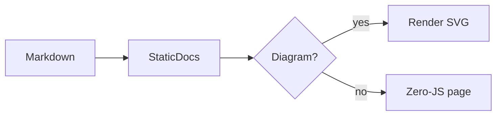
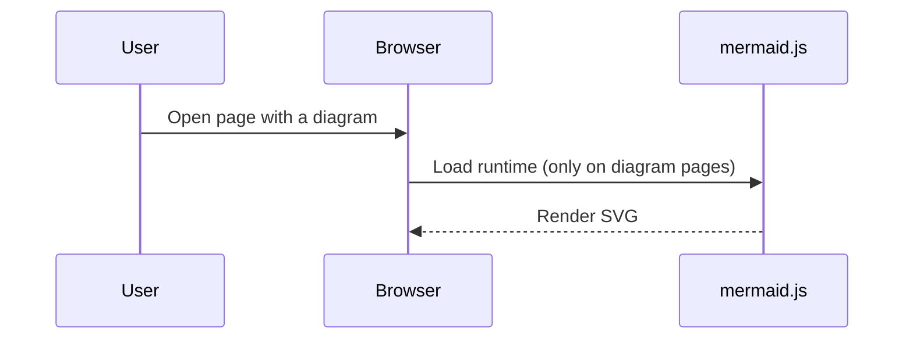

# Diagrams

StaticDocs renders [Mermaid](https://mermaid.js.org/) diagrams from fenced code
blocks. Any code block tagged `mermaid` is turned into a diagram in the browser.

## Usage

Write a fenced code block with the `mermaid` language tag:

````markdown

````

It renders as:


## Sequence diagrams



## Notes

- The mermaid runtime is bundled into your output at `/assets/mermaid.min.js`
  and loaded locally — no CDN or network access required.
- The script is injected **only** on pages that contain a diagram. Pages without
  diagrams stay 100% zero-JS.
